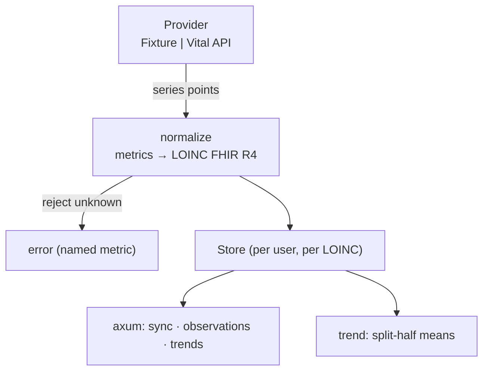

<p align="center">
  <h1>⌚ Wearable Data Ingestion</h1>
  <p><b>Vital-pattern ingestion — normalize wearable series to FHIR R4 Observations, detect trends</b></p>
  <p>
    <a href="https://github.com/akarales/wearable-data-ingestion/actions/workflows/ci.yml"></a>
    
    
    
    
  </p>
</p>

The Vital/Junction integration pattern in miniature: pull wearable series
(Oura / Apple Health via an aggregation API — or the committed fixture
provider for offline dev), **normalize to FHIR R4 Observations**
(LOINC-coded), store them, and detect basic trends. Backend-only by
design — the API is the product. Rust (axum).

**Jump to:** [Features](#-features) · [Architecture](#-architecture) · [Quickstart](#-quickstart) · [Configuration](#️-configuration) · [API](#-api) · [Docs](#-documentation) · [Roadmap](#️-roadmap)

> [!WARNING]
> Demo with synthetic fixture data. Not medical advice.

## ⚡ Features

- **Provider abstraction** — `Fixture` (committed JSON: tests + offline
  demo) vs `Vital` (the real aggregation API when configured) behind one
  enum: the "one client, many wearables" pattern
- **FHIR normalization** — provider metrics → LOINC-coded R4
  Observations (8867-4 heart rate, 80404-7 HRV, 93831-6 sleep,
  55423-8 steps); unknown metrics are **rejected, never silently mapped**
- **Trend detection** — split-half mean direction per series
- **Full-pipeline tests** — sync → FHIR out → trends, all against the
  fixture: zero network, zero accounts

## 📐 Architecture



## 🚀 Quickstart

```bash
cargo run    # :8009 — fixture provider by default

curl -X POST localhost:8009/api/v1/users/ada/sync \
  -H 'content-type: application/json' -d '{"days": 30}'

curl localhost:8009/api/v1/users/ada/trends
curl 'localhost:8009/api/v1/users/ada/observations?loinc=8867-4'
```

## ⚙️ Configuration

| Variable | Default | Notes |
|----------|---------|-------|
| `APP_PORT` | `8009` | 8000–8008 taken on this machine |
| `APP_VITAL_API_KEY` | — | unset → fixture provider |
| `APP_VITAL_USER_ID` | — | unset → fixture provider |
| `APP_VITAL_BASE_URL` | `https://api.tryvital.io` | sandbox |

## 📡 API

| Endpoint | Purpose |
|----------|---------|
| `GET /health` | liveness |
| `POST /api/v1/users/{id}/sync` | pull window from provider → normalize → store |
| `GET /api/v1/users/{id}/observations?loinc=` | FHIR R4 Observations out |
| `GET /api/v1/users/{id}/trends` | per-series direction reports |

curl + JSON: [docs/API.md](docs/API.md).

## 📚 Documentation

| Page | What's inside |
|------|---------------|
| [docs/ARCHITECTURE.md](docs/ARCHITECTURE.md) | Provider enum, LOINC mapping table, store shape |
| [docs/API.md](docs/API.md) | Sync/observations/trends with payloads |
| [docs/DEVELOPMENT.md](docs/DEVELOPMENT.md) | Setup, fixture regeneration, adding metrics |

## 🗺️ Roadmap

<details>
<summary>Phased plan</summary>

- [x] Phase 0 — scaffold: provider, normalization, trends, CI
- [ ] Phase 1 — real Vital sandbox credentials + webhooks
- [ ] Phase 2 — richer metrics (SpO2, respiratory rate) + daily rollups
- [ ] Phase 3 — hand off to the biomarker-trend-analyzer drift engine

</details>

## 🤝 Contributing

PRs welcome — see [CONTRIBUTING.md](CONTRIBUTING.md). Gates: `cargo
clippy --all-targets -- -D warnings`, `cargo test -q`.

## 📄 License

MIT — see [LICENSE](LICENSE).
